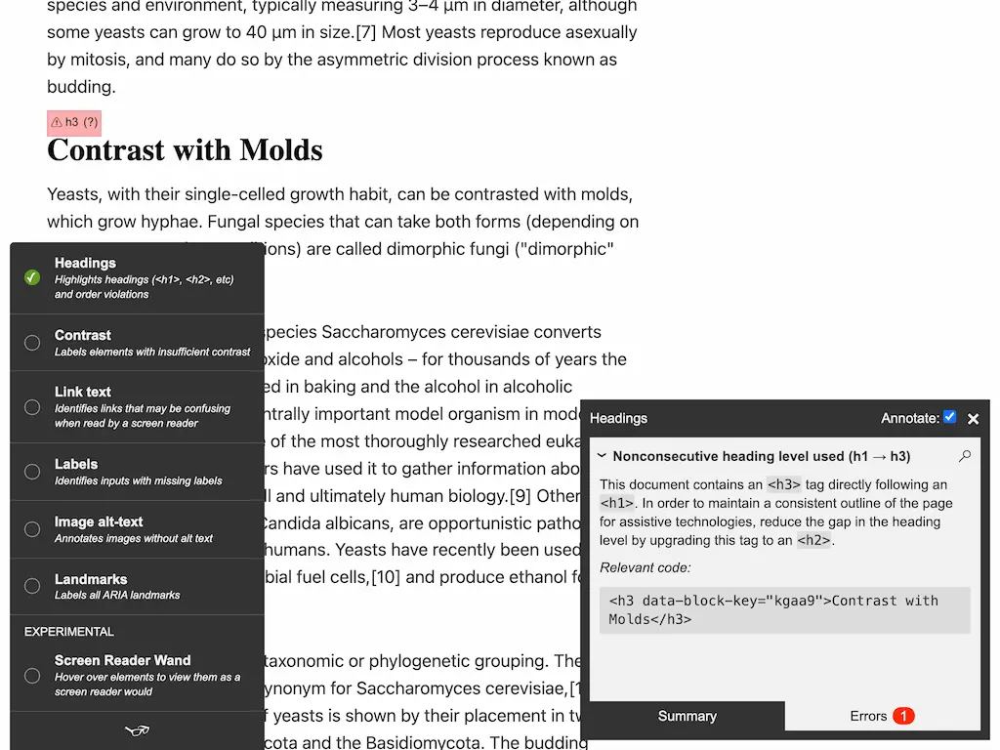

# [wagtail-accessibility](https://pypi.org/project/wagtail-accessibility/)

✅ Accessibility content checks for Wagtail websites. Try it out on our [static demo page](https://wagtail-nest.github.io/wagtail-accessibility/)!

---

[](https://wagtail-nest.github.io/wagtail-accessibility/)

## Installing

Install using pip:

``` bash
pip install wagtail-accessibility
```

Then add `wagtailaccessibility` to your `INSTALLED_APPS`. It works with Wagtail 4.1 and upwards.

## Using

This plugin, when added to your template, will add [tota11y](https://github.com/jdan/tota11y) to all page previews.
Tota11y is an accessibility visualization toolkit.

To use it, simply include this in your template, and from now on all page previews will include it.

```jinja2


```

## Jinja2

This plugin also contains a jinja2 implementation, to use it, include
the following in your config.

```python
{
    'BACKEND': 'django.template.backends.jinja2.Jinja2',
    'OPTIONS': {
        'extensions': [
            # […]
            'wagtailaccessibility.jinja2tags.tota11y',
        ],
    },
}
```

The template tag can then be used like so:

```jinja2
{{ tota11y() }}
```
